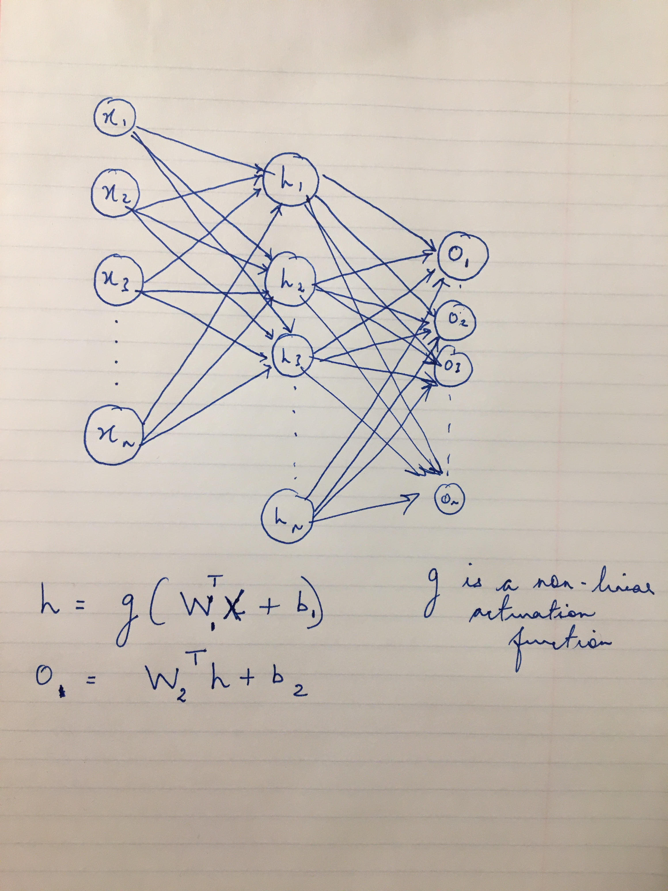

Introduction
============

The purpose of this exercise is to get you accquainted with the basic
operations of a fully connected neural network. We shall look at the two
operations.

-   Forward Propogation (aka Forward prop)
-   Backward Propogation (aka Backward prop)

About the Dataset
=================

Format and keywords of the files
--------------------------------

There are two file formats in the `data` directory.

-   `.csv`-These files contain the actual training or test features.
    Notice the keywords **dev** and **train** . These denote the test
    and train datasets' features respectively.
-   `.txt`-These files contain the label associated with the respective
    `train` or `dev` file

Music: Hit or not
-----------------

The first task is to predict whether a song was a ‘hit’, meaning that it
made it onto the Billboard Top 50 — each instance has a label “Hit?”
equal to “yes” (1) or “no” (0). The attributes or features are: year of
release(multi-valued discrete, range \[1900, 2000\]), length of
recording (continuous, range \[0, 7\]), jazz (binary discrete,
“yes”/“no”), rock and roll (binary discrete, “yes”/“no”). As you might
have guessed, this is a classification problem.

Final Score from my assignments' scores
---------------------------------------

he second task is to predict the final student scores in a high school
course. The attributes are student grades on 2 multiple choice
assignments M1 and M2, 2 programming assignments P1 and P2, and the
final exam F. The scores of all the components are integers in the range
\[0, 100\]. All the attributes are multivalued discrete. Again, check
the csv files to see the attribute values. The final out- put is also
integer with a range \[0, 100\]. Notice that, for this problem, we are
performing regression.

Thinking about your Neural net's architecture
=============================================

There are several things that you might want to consider before you
start coding your architecture. To name a few:

-   Initialization of weights
-   Number of units in the hidden layer
-   Network connectivity
-   Number of epochs\* (or, when to stop the training)
-   Pre-processing and post-processing of input and output
-   Learning rate

***epoch*** is a single traversal over your training set when you run
your optimization (here, gradient descent).

What you can use for this exercise
----------------------------------

**Universal Approximate Theorem**-Recall how the following computation
graph can be used to approximate almost any function. (Chapter 6, Pg.
92).\
{width="500px"}\
**g** can be any non-linear activation function, say sigmoid.\
**W~1~, b~1~** is the weight matrix between the input and hidden layer.
Similarly, **W~2~, b~2~** is the weight matrix between the hidden layer
and the output layer. **For the sake of simplicity, it is recommended
that you implement a single hidden layer architecture**.\
It might be worthwhile to spend some time pondering about the dimensions
of the various matrices and vectorizing your operations.

Stochastic Gradient Descent
---------------------------

Consider implementing stochastic gradient descent. Instead of performing
a single pass of forward and backward prop over the entire dataset,
stochastic gradient descent updates the weights of the neural net one
training example at a time. This is not a compulsion as the number of
training examples are not that many, and you won't require any GPUs or
concurrent computations which require splitting your dataset.

Forward propogation
===================

This should be straight-forward.\
h = *g*(**W**^T^~1~x + **b**~1~)\
o = **W**^T^~2~h + **b**~2~\
**Note** that x, h, o, and b are column vectors in the above equations.
You can also vectorize the operation over the entire dataset by thinking
of x as the design matrix of the dataset instead of one row at a time.

Backward propogation
====================

Error function e = (o - y)^2^/2, where y is the value associated with
the training example x. For a single layer architecture the update
equations become:
